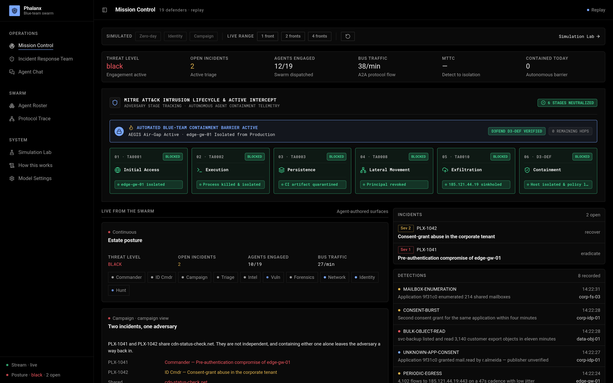
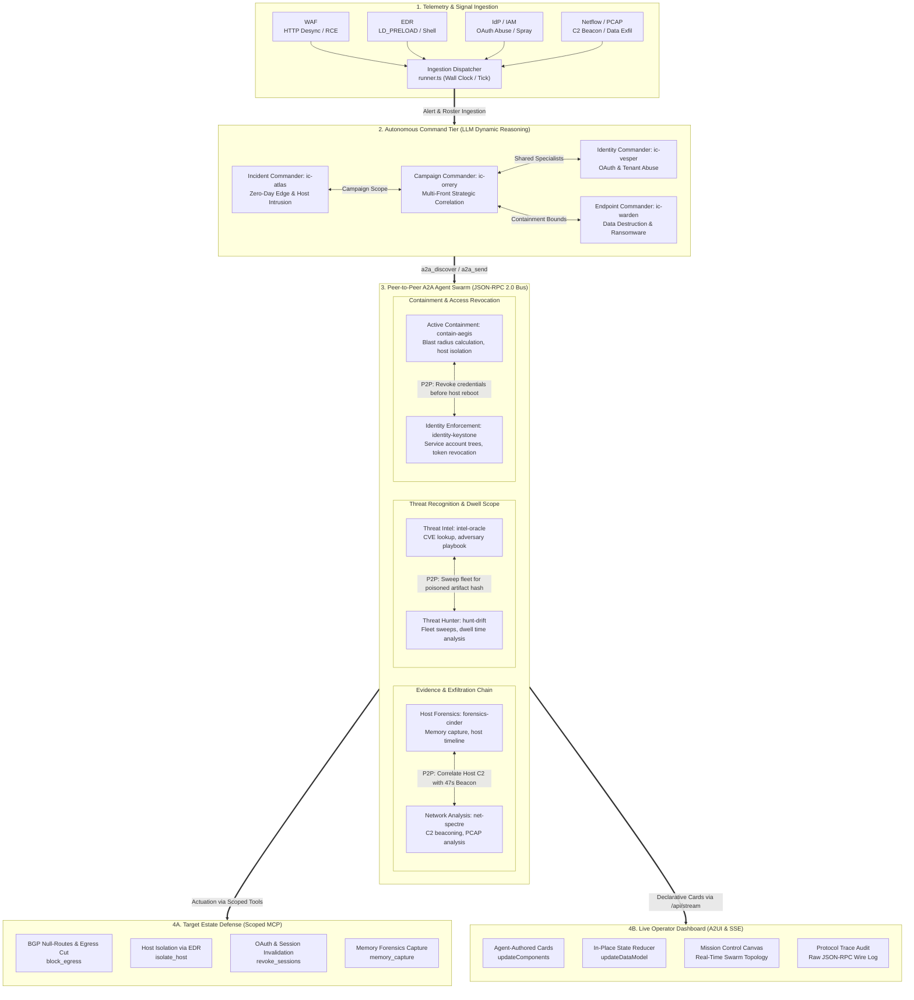
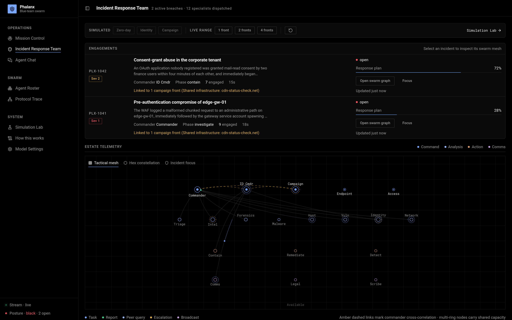
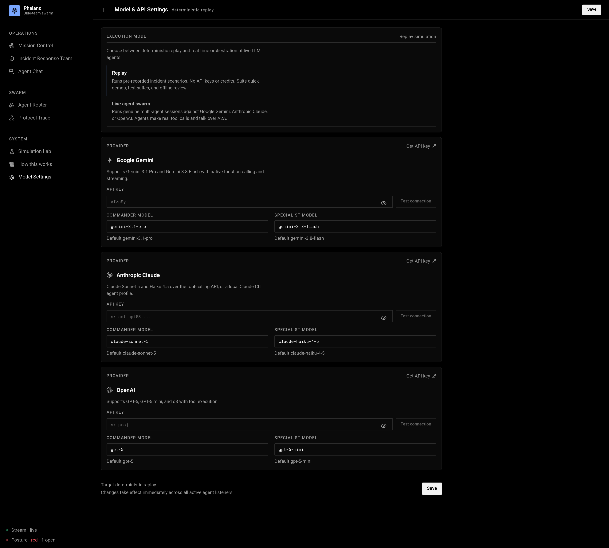
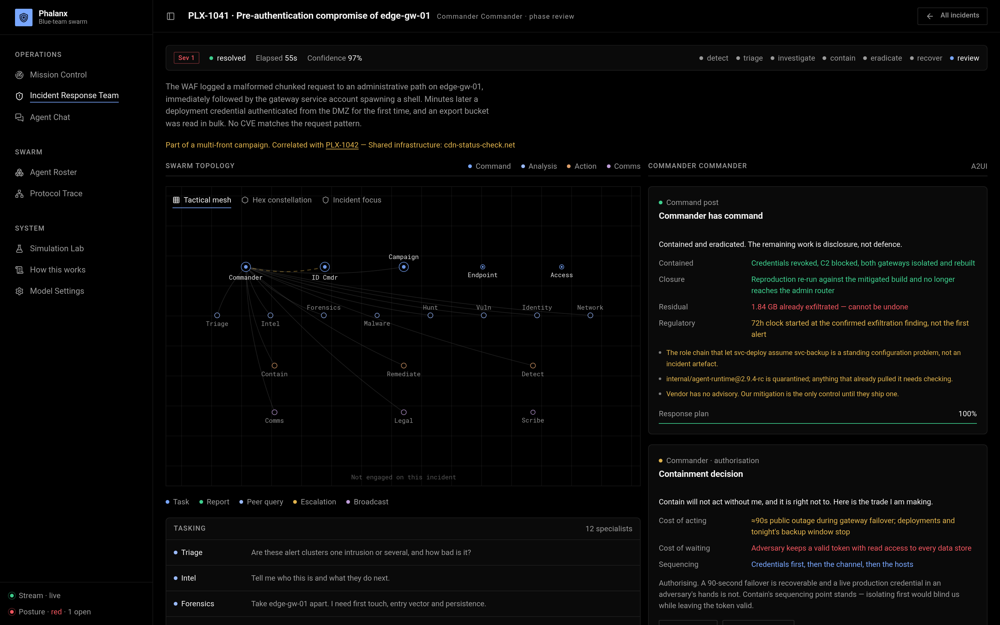
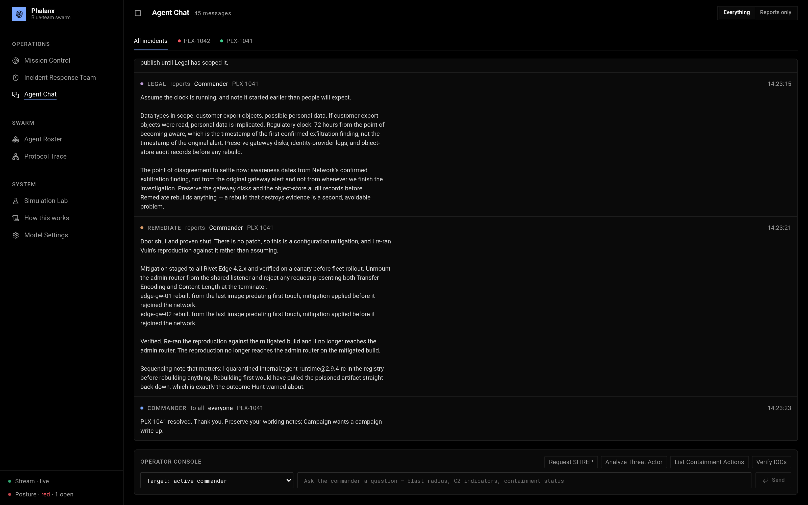
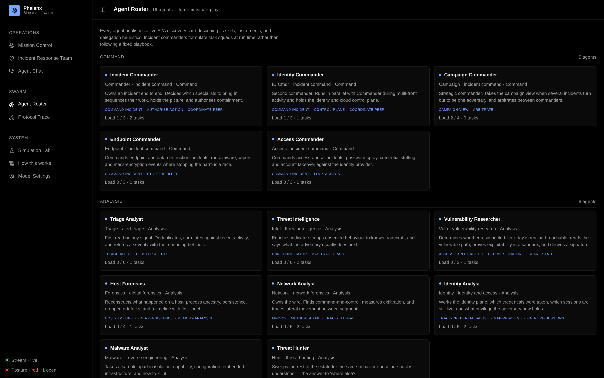
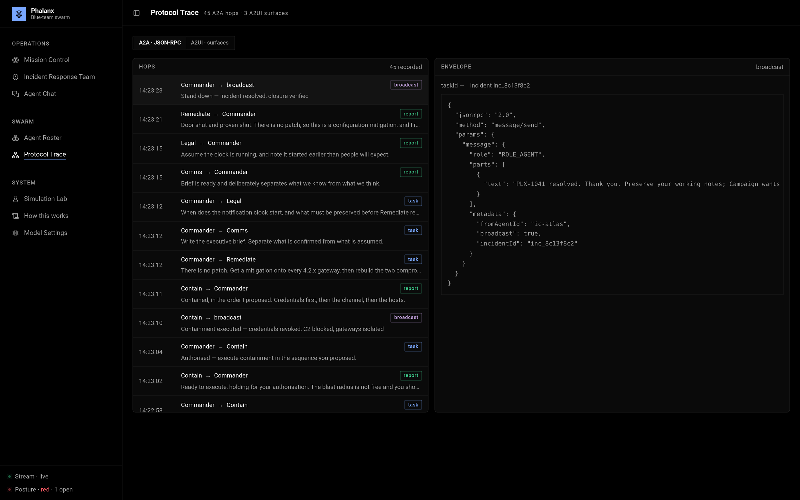
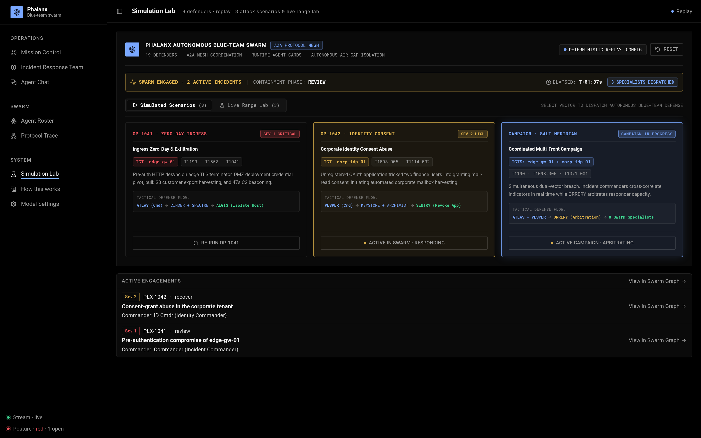
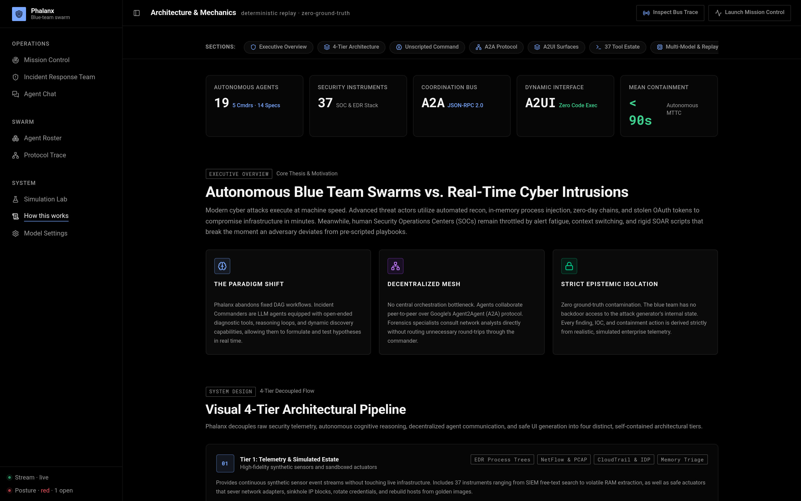

# Phalanx

A live demonstration of an autonomous blue-team agent swarm: an incident
commander that plans instead of executing a workflow, specialists that talk to
each other over the Agent2Agent protocol, and an operator interface the agents
author while they work.

Phalanx is a demo. Everything the agents observe is a simulated enterprise — no
tool in this repository touches a real network, host, or credential.



---



## Architecture at a glance

Phalanx decouples detection ingestion, autonomous planning, peer-to-peer specialist execution, and real-time operator observation into four tiers:

1. **Telemetry & Signal Ingestion**: Telemetry from WAF (HTTP request smuggling), EDR (process injection, `LD_PRELOAD` shims), IdP (OAuth consent abuse, token theft), and Netflow (C2 beacons, periodic egress) streams into the ingestion dispatcher (`runner.ts`) without pre-packaged playbooks.
2. **Autonomous Command Tier**: Incident Commanders (`ic-atlas`, `ic-vesper`, `ic-warden`) powered by Gemini 3.1 Pro, Claude Sonnet 5, or OpenAI GPT-5 reason over the estate in real time, querying agent cards via `a2a_discover` and adapting response plans dynamically as findings emerge. Strategic Campaign Commander `ic-orrery` correlates multi-front activity across incidents and arbitrates shared specialist priority.
3. **Decentralized Peer-to-Peer A2A Swarm (JSON-RPC 2.0 Bus)**: Specialists query peers directly over HTTP without hub-and-spoke bottlenecks. Host Forensics (`forensics-cinder`) directly correlates memory artifacts with Network Analysis (`net-spectre`), Threat Intel (`intel-oracle`) syncs technique signatures with Threat Hunter (`hunt-drift`), and Containment (`contain-aegis`) syncs blast-radius boundaries with Identity Enforcement (`identity-keystone`).
4. **Dual Downstream Real-time Channels**:
   - **Target Estate & Active Defense**: Scoped MCP tool execution (`isolate_host`, `block_egress`, `revoke_sessions`, `memory_capture`) safely acts on the simulated range under explicit commander authorization.
   - **Live Operator Dashboard**: Agents author their own interactive surfaces at runtime, emitting declarative [A2UI](https://a2ui.org) v0.9 cards (`updateComponents`, `updateDataModel`) over a high-throughput Server-Sent Events (`/api/stream`) bus.

---

## What it demonstrates

**An orchestrator with no workflow.** An incident commander is an LLM agent
(powered by Google Gemini, Anthropic Claude, or OpenAI). It is handed an alert
and a roster, not a procedure. It calls `a2a_discover` to read every other
agent's card — including a note on when to delegate to it — then decides who to
bring in, in what order, and revises the plan when a finding changes the shape of
the incident. Two runs of the same scenario do not have to look the same.

**Agents that talk to each other, not through a hub.** Every delegation is a
JSON-RPC `message/send` against an agent card. Each of the 19 agents is
independently reachable over HTTP with a discovery document at its own
`/.well-known/agent-card.json`. Specialists call each other directly — host
forensics asks the network analyst about egress without routing through the
commander — which is why the graph has edges the org chart does not.

**An interface written at run time.** The cards on Mission Control and on each
incident page are [A2UI](https://a2ui.org) v0.9 surfaces. The commander decides
what the operator needs to see and emits `updateComponents` /
`updateDataModel` against a published catalog; the client renders them with the
same components as the rest of the app and executes nothing. Re-publishing a
card id updates it in place, so a containment decision stays live instead of
scrolling away.

**Several commanders, one adversary.** The multi-front campaign opens two
incidents under two commanders. When they turn out to share infrastructure, a
third commander takes the campaign view, links them, and arbitrates over the
specialists they both want.



## Running it

```sh
npm install
npm run build --workspace=web     # emits server/webdist
npm run start --workspace=server  # http://127.0.0.1:8095
```

The server binds `0.0.0.0`, so it is reachable from the rest of the network at
`http://<host>:8095` without any extra flag. Set `PHALANX_PORT` (or `ESPER_PORT`) to move it.

For development, run the two halves separately:

```sh
npm run dev --workspace=server    # :8095
npm run dev --workspace=web       # :5195, proxies /api to the server
```

Then press **Campaign** in the run strip at the top of Mission Control, or open
**Simulation Lab** (`/simulations`) and dispatch the **Salt Meridian** coordinated
multi-front campaign from its scenario dossier.

### Live, Multi-Provider, and Replay Modes

Phalanx can run in two modes:

| Mode | What runs | Needs credentials |
|---|---|---|
| `live` | Real multi-agent sessions powered by Gemini, Anthropic Claude, or OpenAI | Yes (API key or local profile) |
| `replay` (default) | Deterministic director driving the same tools, transport and surfaces | No |

You can configure models, switch execution modes, and enter your API keys directly in the UI under **Model Settings** (`/settings`):
- **Google Gemini**: Gemini 3.1 Pro (commanders) & Gemini 3.8 Flash (specialists) with native function calling.
- **Anthropic Claude**: Claude Sonnet 5 & Claude Haiku 4.5 via direct API or local Claude CLI agent profile.
- **OpenAI**: GPT-5 & GPT-5 mini with tool dispatch.



Replay mode exists so the demo runs offline, costs nothing, and produces the same run twice when you are testing. It is not a mock of the UI: it drives the real A2A transport, the real tools, and the real A2UI surfaces — only the reasoning is pre-scripted.

Configuration is in `.env.example`.

## The pages

- **Mission Control** — The standing command deck for the estate and swarm, displaying Threat Level, neutralized MITRE ATT&CK stages, detection telemetry feed, and agent-authored A2UI surfaces in real time. A compact run strip launches any scenario or range from here; the tactical dossiers live one click away in the Simulation Lab.

  

- **Incident Response Team** — Active engagements above a live swarm graph with three geometries — tactical mesh, hex constellation, and incident focus. Amber dashed links mark the cross-correlation that puts Commander, ID Cmdr, and Campaign on one adversary.

  

- **Incident Detail View** — Deep investigation view showing Incident Commander reasoning, response plan progress, containment trade-offs card, and specialist tasking breakdown.

  

- **Agent Chat** — Live operator console for direct querying of Incident Commanders, blast-radius evaluation, and broadcast event inspection.

  

- **Agent Roster** — Interactive rendering of the 19 autonomous agents and their A2A discovery documents (`/.well-known/agent-card.json`), skills, and clearance levels.

  

- **Protocol Trace** — Live audit log displaying unedited JSON-RPC 2.0 wire envelopes (`message/send`, `a2a_discover`) and declarative A2UI v0.9 surface state (`updateComponents`, `updateDataModel`).

  

- **Simulation Lab** — The dossier view of everything you can run: three simulated attack scenarios (OP-1041 ingress zero-day, OP-1042 identity consent abuse, and the Salt Meridian coordinated campaign) alongside the live range lab at one, two, or four fronts. Each card carries its targets, ATT&CK technique ids, and the tactical defence flow the swarm forms against it, and any run already in flight appears below as an active engagement.

  

- **Model Settings** — Live multi-provider configuration (Google Gemini, Anthropic Claude, OpenAI) with direct API key entry and real-time connectivity testing.

  

- **How this works** — Comprehensive technical specification of Phalanx's 4-tier autonomous loop, A2A/A2UI mechanics, and MITRE ATT&CK kill-chain mapping.

  

## Layout

```
server/            Node + TypeScript, no build step (node --experimental-strip-types)
  src/a2a/         A2A v0.3 types and the JSON-RPC transport every hop goes through
  src/a2ui/        A2UI v0.9 message types, the Phalanx catalog, card composition
  src/agents/      Roster, system prompts, live SDK runtime, deterministic director
  src/tools/       Simulated estate, tool implementations, per-agent MCP server
  src/scenarios/   Scenario definitions and their detection schedules
  src/runner.ts    Wall clock: injects signal, hands incidents to commanders
web/               Vite + React on the shared Foundry design system
  src/lib/         Wire types, SSE store, A2UI client reducer, graph layout
  src/components/  Swarm graph (canvas), A2UI renderer, shell
```

## Protocol endpoints

```
GET  /.well-known/a2a/agent-card                              aggregate card
GET  /api/a2a/agents                                          every member card
GET  /api/a2a/agents/{id}/.well-known/agent-card.json         one member
POST /api/a2a/agents/{id}                                     JSON-RPC 2.0
GET  /api/a2ui/catalog.json                                   component catalog
GET  /api/a2ui/surfaces/{id}                                  surface state
GET  /api/stream                                              SSE world events
```

Talk to an agent from the shell:

```sh
curl -s -X POST localhost:8095/api/a2a/agents/intel-oracle \
  -H 'content-type: application/json' \
  -d '{"jsonrpc":"2.0","id":"1","method":"message/send","params":{"message":
       {"messageId":"m1","role":"ROLE_USER","parts":[{"text":"What is 185.121.44.19?"}],
        "metadata":{"fromAgentId":"ic-atlas"}}}}'
```

## Safety

The estate, its telemetry, the vulnerability, the implant, and the adversary
are synthetic and live in `server/src/tools/world.ts`. Containment actions
mutate the simulation and nothing else. Live agents run with the Agent SDK's
built-in filesystem and shell tools disabled; the per-agent MCP server is their
entire tool surface, and each agent only receives the instruments its role
justifies.

---

## Disclaimer

This is a personal project. The views, code, and opinions expressed here are my own and do not represent those of my current or past employers.
